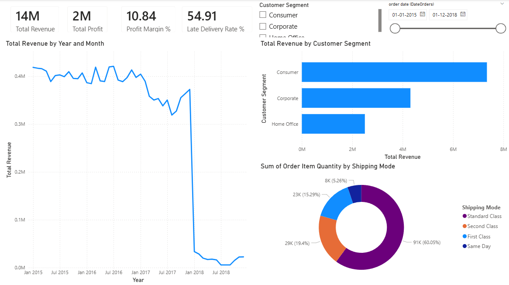
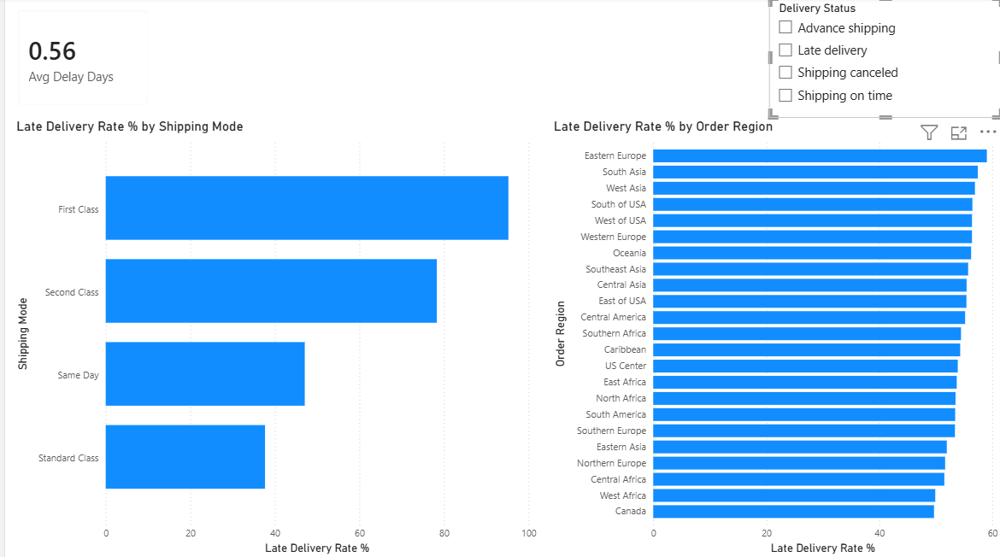
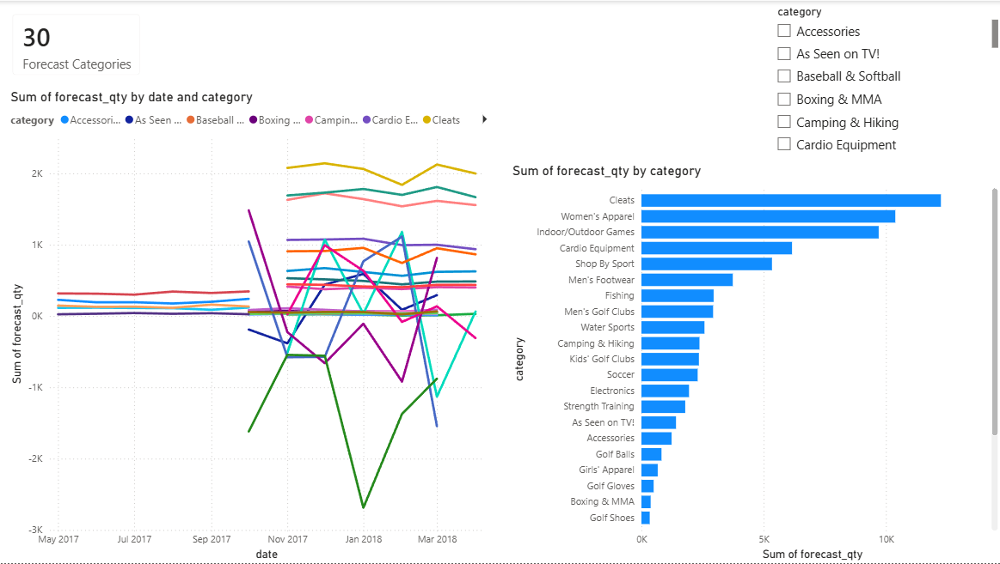

# Supply Chain Performance & Demand Forecasting

## Overview
End-to-end supply chain analytics project combining SQL data engineering,
Python demand forecasting (Facebook Prophet), and Power BI executive dashboards
applied to 180,000+ real-world transactions.

## Dashboard Preview




## Tech Stack
- **SQL (SQLite)** — Data cleaning, KPI queries, window functions, CTEs
- **Python (Prophet, pandas)** — Demand forecasting across 30 product categories
- **Power BI** — 3-page interactive executive dashboard

## Dataset
DataCo Global Supply Chain Dataset | 180,519 rows | 53 columns | [Kaggle](https://www.kaggle.com/datasets/shashwatwork/dataco-smart-supply-chain-for-big-data-analysis)

## Key Findings
- **First Class shipping has a 95.32% late delivery rate** — customers paying premium are receiving the worst service
- **Eastern Europe and South Asia** are the highest-risk regions for late deliveries
- **Standard Class** is the most reliable shipping mode at only 38.07% late rate
- **Consumer segment** drives the most revenue (~$7M out of $14M total)
- **Cleats and Women's Apparel** lead forecasted demand growth over the next 6 months
- Late delivery rate is structurally consistent at ~54-55% monthly — not seasonal

## Project Structure
```
supply-chain-sql-powerbi/
├── data/                          # Raw dataset
├── sql/                           # 4 SQL analysis files
│   ├── 01_data_cleaning.sql
│   ├── 02_delivery_kpis.sql
│   ├── 03_profitability_analysis.sql
│   └── 04_shipping_performance.sql
├── python/                        # Demand forecasting
│   ├── demand_forecast.py
│   └── output/forecast_results.csv
├── powerbi/                       # Dashboard file
│   └── SupplyChainDashboard.pbix
└── screenshots/                   # Dashboard previews
```

## How to Run
1. Download dataset from Kaggle link above into `/data`
2. Import CSV into SQLite and run SQL files in `/sql` in numbered order
3. `pip install -r python/requirements.txt`
4. `python python/demand_forecast.py`
5. Open `powerbi/SupplyChainDashboard.pbix` in Power BI Desktop